# Plateforme AI embarquée sur Rock Pi 5 (LLaMa autonome) 
Réalisation d’un démonstrateur sur la carte Rock Pi 5 avec Whisper (Speech-to-
Text), Llama2 (sur NPU) et Piper .
## Contexte
Avec l’essor des SBC dédiées à l’IA, le SoC RK3588 se distingue par son NPU de 6 TOPs, optimisant l’inférence des réseaux de neurones. Ce projet exploite ces capacités pour des applications audio et vidéo sur une Rock Pi 5 sous Linux.  

Développée par Radxa, la Rock Pi 5 embarque un SoC RK3588 avec un CPU octa-core (4× Cortex-A76 + 4× Cortex-A55), un GPU Mali-G610 MP4 et une NPU de 6 TOPs, la rendant idéale pour l’IA, l’edge computing et le traitement multimédia.


<p align="center">
  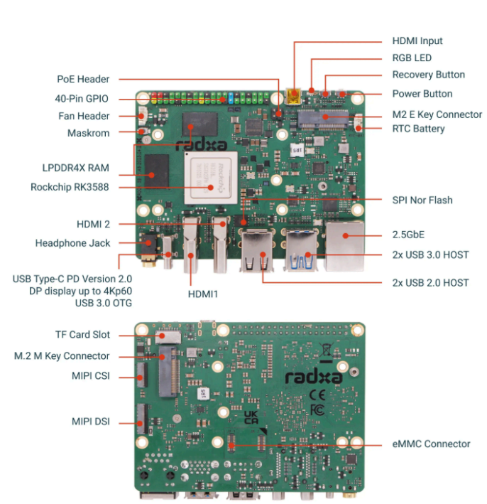
</p>


## Description du sujet
L'objectif de ce projet est d'optimiser l'exécution des modèles d'IA sur le NPU du RK3588. Nous déploierons d'abord Llama2 en exploitant les bibliothèques de support pour améliorer les performances d'inférence. Ensuite, nous intégrerons Whisper (reconnaissance vocale) et Piper (synthèse vocale) afin de créer un assistant vocal local, assurant un flux continu : entrée vocale → traitement par Llama2 → sortie vocale avec Piper. Une fois l'implémentation sur Rock Pi 5 achevée, nous avons également exploré la mise en place d'un serveur web pour un accès distant via PC ou téléphone, ce qui sera détaillé par la suite.


## Demonstration des applications 

### Cliquez sur l'image au-dessous pour télécharger la vidéo de démonstration de l'application locale
[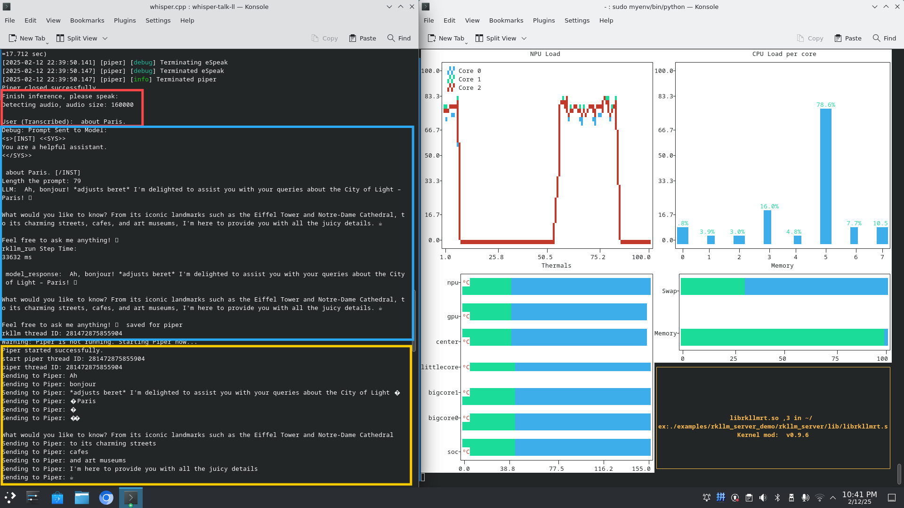](https://drive.google.com/file/d/1qFW8w_BLaTOvMnAr35MSFvWoepLbVYpI/view?usp=sharing)

#### shéma
<p align="center">
  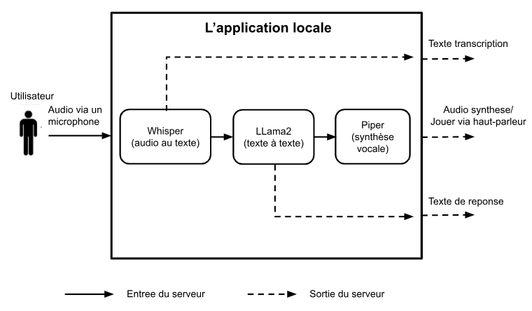
</p>


### Cliquez sur l'image au-dessous pour télécharger la vidéo de démonstration de l'application déploye sur serveur gradio
[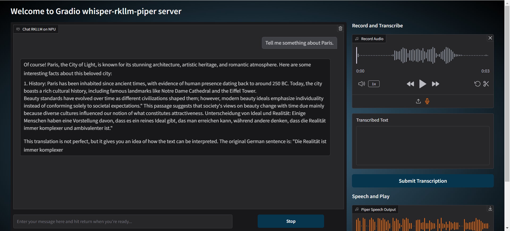](https://drive.google.com/file/d/11GqKl9m6_AcClNhnvnNYWsRWcqZ5MGho/view?usp=sharing)

#### shéma
<p align="center">
  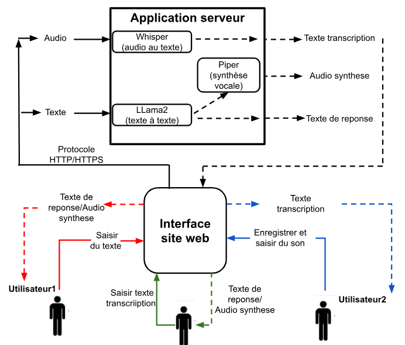
</p>


## Comparaison des performances des deux modes d'accelerations(NPU et Neon de CPU)
<p align="center">
  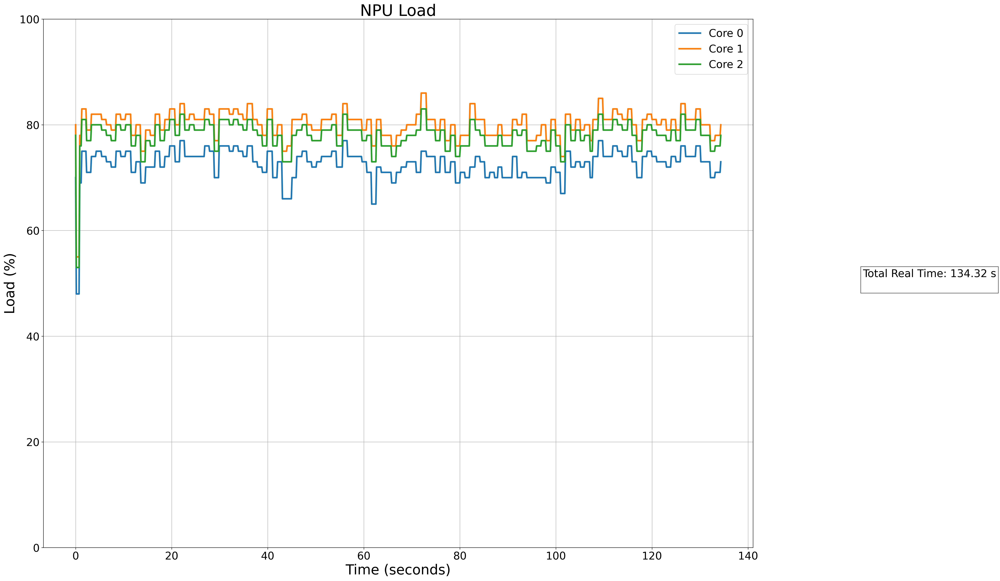
  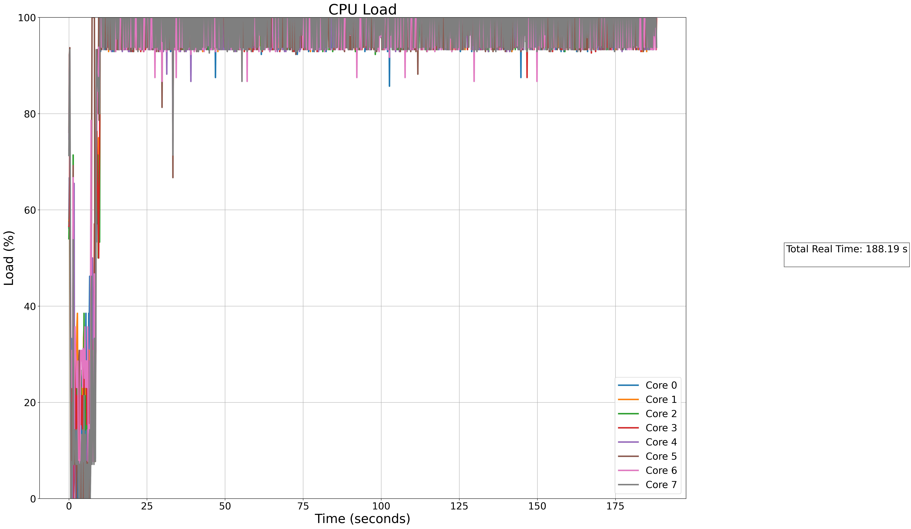
</p>
### Longueur de tokens prompt fixe, longueur de tokens sortie varie:
<p align="center">
  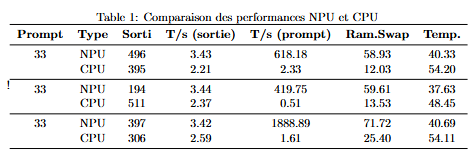
</p>

### Longueur de tokens prompt varie, longueur de tokens sortie fixe:
<p align="center">
  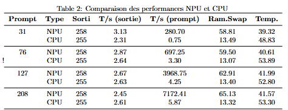
</p>

**Les explications des tableaux sont dans le rapport**


## Driver NPU 0.9.6
[Image système ROCK 5B (noyau 6.1)](https://docs.radxa.com/rock5/rock5b/download)

<p align="center">
  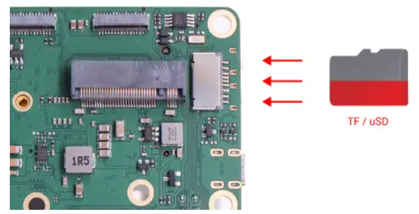
  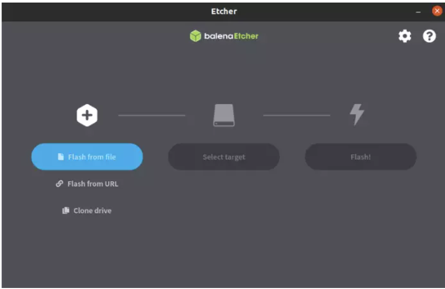
</p>

## Explication dossier

### modele_rkllm/
**conversion.py**: Convertit le modèle Llama2 du format GGUF au format RKLLM.  
**ntop.sh**: Surveille la mémoire RAM et Swap pendant la conversion. (Exécution : `bash ntop.sh`)  

### Compilation_croisée (rkllm)/
Il faut modifier le chemin de la chaîne d’outils de compilation croisée selon votre configuration.  
**build-linux.sh**: Script de compilation croisée pour PC Linux.  
**build-linux_win.sh**: Script de compilation croisée pour PC Windows.  
**CMakeLists.txt**: Configuration pour CMake.  

### Comparaison_npu_cpu/
Ce dossier contient les images issues de la comparaison des performances des deux modes d’accélération à l’aide de l’outil de surveillance `rknputop.py`.  
Installation des dépendances :  
	```bash

	sudo apt install python3.11-venv
	
	python3 -m venv myenv
	
	source myenv/bin/activate
	
	pip install plotext psutil
	sudo /your_home_path/myenv/bin/python ./rknputop
	```
Pour surveiller les indicateurs lors de l'utilisation de Llama2, il faut d'abord exécuter `rknputop`, puis lancer le modèle Llama2. Les images et fichiers `.csv` sont enregistrés dans `/your_home_path/logs/`.

### Pipeline/
#### rkllm/
**main.cpp**: Programme de lancement du modèle RKLLM.  
**llama_format**: Programme exécutable pour cible ARM64.  

#### rkllm_server/
**lib/**: Déposez ici la bibliothèque dynamique `librkllmrt.so`.  
**fix_freq_rk3588.sh**: Fixe une fréquence stable pour optimiser les performances du NPU, CPU, DMC et GPU.  
**gradio_server.py**: Serveur Gradio pour l’inférence du modèle RKLLM.  
**whisper_rkllm_piper_server.py**: Serveur gradio pour l’inférence Whisper et Llama2-Piper.  

#### whisper-rkllm-piper/
Remplacez `CMakeLists.txt` dans `Whisper.cpp/examples/talk-llama/` et `Whisper.cpp/` pour intégrer les API RKLLM.  
**talk-llama.cpp**: Implémentation de la combinaison Whisper-Llama2-RKLLM-Piper.  

---
## Utilisation

### Llama2.rkllm sur NPU (version du modele 1.0.0)
#### 1. Conversion du modèle (PC Linux/Windows)  
	```bash
	wget -c https://mirrors.bfsu.edu.cn/github-release/conda-forge/miniforge/LatestRelease/Miniforge3-Linux-x86_64.sh

	chmod 777 Miniforge3-Linux-x86_64.sh

	bash Miniforge3-Linux-x86_64.sh

	source ~/miniforge3/bin/activate  # miniforge3 est le répertoire d'installation

	conda create -n RKLLM-Toolkit python=3.8

	conda activate RKLLM-Toolkit

	pip3 install rkllm_toolkit-1.0.0-cp38-cp38-linux_x86_64.whl

	python /model_rkllm/conversion.py
	```

#### 2. Compilation croisée (PC Linux/Windows)
Outils de compilation croisée recommandés :  
- **Windows** : `gcc-arm-10.2-2020.11-mingw-w64-i686-aarch64-none-linux-gnu.tar.xz` ([Téléchargement](https://developer.arm.com/downloads/-/gnu-a/10-2-2020-11))  
- **Linux** : `gcc-arm-10.2-2020.11-x86_64-aarch64-none-linux-gnu` ([Téléchargement](https://developer.arm.com/downloads/-/gnu-a/10-2-2020-11))  
Exécution :  
	```bash

	bash build_linux_win.sh

	bash build_linux.sh
	```

#### 3. Préparation  
Déplacez `librkllmrt.so` dans :  
	```bash

	/path/to/your/rkllm/lib/
	```
Ajoutez `ulimit -n 1024000` à `~/.bashrc` :  
	```bash

	echo "ulimit -n 1024000" >> ~/.bashrc

	source ~/.bashrc
	```

#### 4. Exécution  
Mode interactif :  
	```bash

	./llm_demo /path/to/your/rkllm/model
	```
Mode fichier :  
	```bash

	./llm_demo /path/to/your/rkllm/model --file ./prompts.txt
	```

---
### Llama2.gguf sur Neon de CPU
Installation et compilation :  
	```bash

	git clone https://github.com/ggerganov/llama.cpp

	python3 -m pip install torch numpy sentencepiece

	sudo apt install g++ build-essential

	cmake -B build

	cmake --build build --config Release -j$(nproc)

	wget https://huggingface.co/TheBloke/Llama-2-7b-Chat-GGUF/resolve/main/llama-2-7b-chat.Q8_0.gguf

	./build/bin/llama-cli -m ./models/llama-2-7b-chat.Q8_0.gguf -c 512 -b 1024 -n 256 --keep 48 --repeat_penalty 1.0 --chat-template llama2 --file prompts/prompt.txt
	```

Intégration de RKLLM dans `llama.cpp` :  
	```bash

	cmake -B build

	cmake --build build --config Release -j$(nproc)

	wget https://huggingface.co/TheBloke/Llama-2-7b-Chat-GGUF/resolve/main/llama-2-7b-chat.Q8_0.gguf

	./build/bin/llama_rkllm-cli -m ./models/llama-2-7b-chat.Q8_0.gguf -c 512 -b 1024 -n 256 --keep 48 --repeat_penalty 1.0 --chat-template llama2 --file prompts/prompt.txt
	```

---
### Utilisation de Piper
	Téléchargez piper: piper_linux_aarch64.tar.gz dans https://github.com/rhasspy/piper/releases

	Téléchargez :  (https://huggingface.co/rhasspy/piper-voices/tree/v1.0.0/en/en_GB/southern_english_female/low)

	- `CARTE_MODÈLE`
	- `en_GB-southern_english_female-low.onnx`
	- `en_GB-southern_english_female-low.onnx.json`
	Placez-les dans un dossier `GB_female_south/`.  
Exécution :  
	```bash

	echo 'This sentence is spoken first. This is Smart Computer Lab multimedia and internet module.' | \
	./piper --model GB_female_south/en_GB-southern_english_female-low.onnx --output-raw | \
	aplay -r 15000 -f S16_LE -t raw -
	```
### Utilisation de Whisper
	sudo apt install libsdl2-dev cmake g++

	git clone https://github.com/ggerganov/whisper.cpp

	cd whisper.cpp
 
	cmake -B build -DWHISPER_SDL2=ON

	cmake --build build --config Release
	
	sudo ./build/bin/whisper-stream -m models/ggml-base.en.bin --step 2000 --length 8000 -c 1 -t 6 -ac 512 -vth 0.6 --language en -f transciption.txt -vth 0.6


---
### Applications
#### Exécution locale  
	```bash

	cmake -B build -DWHISPER_SDL2=ON

	cmake --build build --config Release

	./build/bin/whisper-talk-llama -mw ./models/ggml-base.en.bin -ac 512 -t 4
	```
#### Exécution serveur  
	```bash

	python3 gradio_server.py --target_platform rk3588 --rkllm_model_path ~/rkllm/llama2-chat-7b-hf-002.rkllm
	```


## Rapport de stage
Si vous voulez savoir plus de details, Vous pouvez consulter le [rapport de stage ici](https://drive.google.com/file/d/16wGZGj_M-wyHgh3tYu-QNHEvIzETIX-l/view?usp=sharing).


## Modele RKLLM
Vous pouvez obtenir les modeles conversion de version **1.0.0** **1.0.1** **1.1.2** dans le repertoire: 


*modele_rkllm/1.0.0*  
*modele_rkllm/1.0.1*   
*modele_rkllm/1.1.2*  


## Bibliographie
- **Document Radxa rock 5**
[https://docs.radxa.com/rock5/rock5b/app-development/rkllm_install](https://docs.radxa.com/rock5/rock5b/app-development/rkllm_install)

- **RKLLM**
[https://github.com/Pelochus/ezrknn-llm](https://github.com/Pelochus/ezrknn-llm)

- **Llama.cpp**  
[https://github.com/ggerganov/llama.cpp](https://github.com/ggerganov/llama.cpp)

- **Llama huggingface**
[https://huggingface.co/meta-llama/Llama-2-7b-chat-hf](https://huggingface.co/meta-llama/Llama-2-7b-chat-hf)

- **Whisper.cpp** 
[https://github.com/ggerganov/whisper.cpp](https://github.com/ggerganov/whisper.cpp)

- **Whisper huggingface** 
[https://huggingface.co/models?sort=downloads&search=openai%2Fwhisper-](https://huggingface.co/models?sort=downloads&search=openai%2Fwhisper-)

- **Piper**
[https://github.com/rhasspy/piper/tree/master](https://github.com/rhasspy/piper/tree/master)

- **Piper huggingface**
[https://huggingface.co/rhasspy/piper-voices/tree/v1.0.0/en/en_GB/southern_english_female/low](https://huggingface.co/rhasspy/piper-voices/tree/v1.0.0/en/en_GB/southern_english_female/low)

##

####Remerciement pour le document d'implementation des modeles IA de M.Bakowski dans smartcomputerlab 
[https://drive.google.com/file/d/1Iyz1a4ZtbjnAakyNkBEV_fVCMsWv47cu/view?usp=sharing](https://drive.google.com/file/d/1Iyz1a4ZtbjnAakyNkBEV_fVCMsWv47cu/view?usp=sharing).

**Smartcomputerlab-Internet-Multimedia-AI**
[https://github.com/smartcomputerlab/M1-Internet-Multimedia-AI](https://github.com/smartcomputerlab/M1-Internet-Multimedia-AI)
